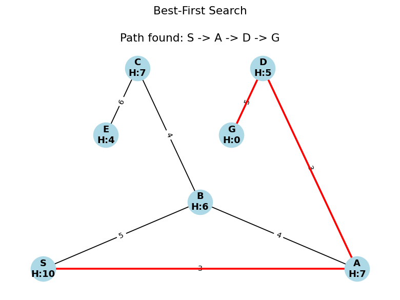

# SearchAlgoViz

Animated visualizations of classic AI graph-search algorithms — build a
weighted graph and watch algorithms like A*, Beam Search, and Branch and
Bound explore it step by step, instead of just reading pseudocode.



## Why

Search algorithms (DFS, BFS, A*, Branch and Bound, ...) are usually taught
with static diagrams and pseudocode. SearchAlgoViz animates the search
frontier expanding over a weighted graph so the difference between, say,
Hill Climbing's greedy myopia and A*'s cost-aware exploration is visible
frame by frame, not just theoretical.

## What's included

The repo has two independent front ends over the same set of algorithm
implementations:

| File | Description |
|---|---|
| [`matplotlib_visualizer.py`](matplotlib_visualizer.py) | Runs a search algorithm over a preset graph and animates it with `networkx` + `matplotlib`. Pick an algorithm from a menu; the figure title shows the algorithm and each frame highlights the path explored so far. |
| [`tkinter_gui.py`](tkinter_gui.py) | Interactive Tkinter app: click to place nodes, right-click twice to connect them with a weighted edge, then press a number key to run an algorithm and watch it animate live on the same canvas. |

### Algorithms implemented

- Depth-First Search (DFS) / Breadth-First Search (BFS)
- British Museum Search (exhaustive, unguided)
- Hill Climbing
- Beam Search
- Oracle Search (exhaustive and heuristic-guided)
- Branch and Bound (plain, with extended list, with estimated heuristics)
- A* Search
- Best-First Search
- AO* Search

All of them are implemented from scratch on a simple adjacency-list `Graph`
class with per-edge weights and per-node heuristics — no search library used.

## Getting started

```bash
git clone https://github.com/mukesh-tp/SearchAlgoViz.git
cd SearchAlgoViz
python3 -m venv venv
source venv/bin/activate        # Windows: venv\Scripts\activate
pip install -r requirements.txt
```

`tkinter_gui.py` only needs the standard library's `tkinter`, which ships
with most Python installs (on Linux you may need `sudo apt install
python3-tk`).

### Run the matplotlib visualizer

```bash
python3 matplotlib_visualizer.py
```

You'll be prompted to pick an algorithm by number; it then animates the
search over a built-in sample graph (`S` to `G`).

### Run the interactive GUI

```bash
python3 tkinter_gui.py
```

Controls (also shown in the app):

| Action | Control |
|---|---|
| Add a node | Left-click on the canvas |
| Connect two nodes | Right-click the first node, then right-click the second |
| Clear the canvas | `x` |
| Choose start / goal | "Set Start" / "Set Goal" dropdowns |
| Run an algorithm | Press `1`-`9` after setting start and goal |

Keybindings: `1` DFS, `2` BFS, `3` Hill Climbing, `4` Beam Search,
`5` British Museum Search, `6` Oracle, `7` Branch and Bound,
`8` Branch and Bound + Extended List, `9` A*.

## Project structure

```
SearchAlgoViz/
├── matplotlib_visualizer.py   # Graph, Algorithm, GraphVisualization classes + CLI menu
├── tkinter_gui.py             # Interactive Tkinter app with the same algorithms
├── docs/                      # README assets
├── requirements.txt
└── LICENSE
```

## License

MIT — see [LICENSE](LICENSE).
